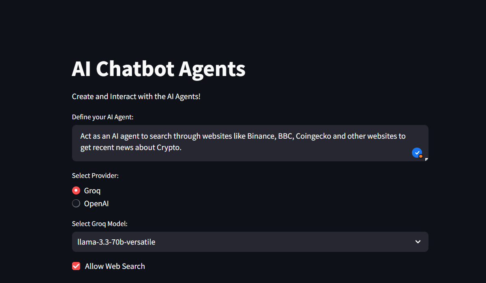
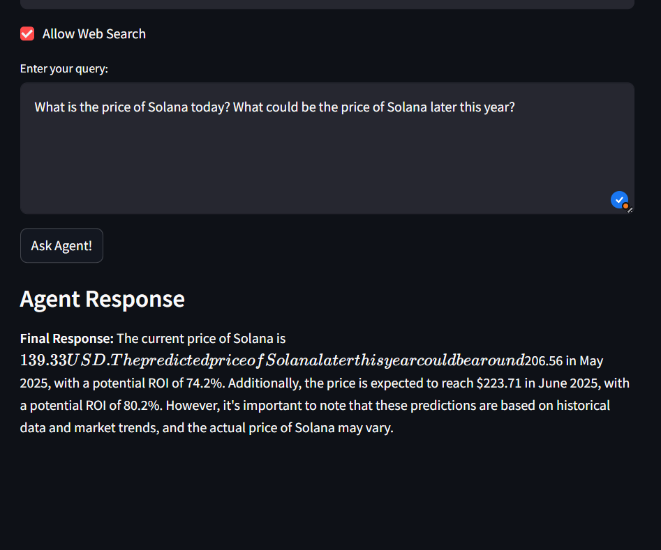

# 🤖 LangGraph AI Agent Chatbot

This project demonstrates the power of AI agents using LangGraph, Groq, OpenAI, and Tavily search integration. Users can interact with multi-provider AI agents via a modern UI built in Streamlit, and backend logic powered by FastAPI.

---

## 🚀 Features

- ⚡ **Multi-provider Support**: Choose between Groq (`llama-3.3-70b-versatile`, `mixtral-8x7b-32768`) and OpenAI (`gpt-4o-mini`) models.
- 🔎 **Optional Web Search**: Enable real-time search via the Tavily Search API.
- 🧠 **Custom AI Agent Personality**: Define your own system prompt to guide the chatbot's tone and behavior.
- 🌐 **FastAPI Backend**: Dynamically handles requests from the frontend UI and interfaces with LangGraph agents.
- 🎨 **Streamlit Frontend**: A clean, interactive UI for seamless conversations with AI agents.

---

## 🧰 Tech Stack Used

| Layer       | Technology                                                                 |
|-------------|-----------------------------------------------------------------------------|
| **Frontend**| `Streamlit` - for interactive UI                                            |
| **Backend** | `FastAPI` - for building RESTful API endpoints                              |
| **Agents**  | `LangGraph`, `LangChain` - for building multi-step AI agents               |
| **LLMs**    | `OpenAI GPT`, `Groq` - supports models like `llama-3`, `mixtral`, `gpt-4o`  |
| **Search**  | `Tavily API` - for real-time, web-augmented search                          |
| **Utilities** | `dotenv`, `requests`, `uvicorn`, `pydantic`, `pipenv`                    |

---

## 📁 Project Structure

```
.
├── .env                        # Environment variables (Groq, OpenAI, Tavily API Keys)
├── ai_agent.py                # Core logic to invoke LangGraph AI agents
├── backend.py                 # FastAPI server to handle chat requests
├── frontend.py                # Streamlit UI for interacting with the chatbot
├── README.md                  # Project documentation
```

---

## 📦 Requirements

Sample `requirements.txt` file:

```
langchain
langchain-openai
langchain-groq
langgraph
streamlit
fastapi
python-dotenv
uvicorn
pydantic
requests
```

---

## 📘 Project Setup Guide

This guide provides step-by-step instructions to set up your project environment, including setting up a Python virtual environment using Pipenv, pip, or conda.

### 1. Setting Up a Python Virtual Environment

#### Using Pipenv
```bash
pip install pipenv
pipenv install
pipenv shell
```

---

#### Using `pip` and `venv`

```bash
python -m venv venv
# Activate the virtual environment:

# macOS/Linux
source venv/bin/activate

# Windows
venv\Scripts\activate

# Then install dependencies
pip install -r requirements.txt
```

---

#### Using Conda

```bash
conda create --name myenv python=3.11
conda activate myenv
pip install -r requirements.txt
```

---

### 2. Running the Application

#### Phase 1: Create AI Agent
```bash
python ai_agent.py
```

#### Phase 2: Start Backend with FastAPI
```bash
python backend.py
```

✅ FastAPI will be hosted at: `http://127.0.0.1:9999`  
✅ Swagger UI available at: `http://127.0.0.1:9999/docs`

#### Phase 3: Start Frontend with Streamlit
```bash
streamlit run frontend.py
```

⚠️ **IMPORTANT:** Run the backend (`backend.py`) in a separate terminal window before launching the frontend.
Also, the .env file is not in this repository as sharing API keys is not safe. Please create a .env file and add your API keys.

---

## 📷 Screenshots





---

## 🙌 Credits

- [LangGraph](https://github.com/langchain-ai/langgraph)
- [LangChain](https://github.com/langchain-ai/langchain)
- [Groq](https://groq.com/)
- [OpenAI](https://openai.com/)
- [Tavily Search API](https://app.tavily.com/)

---

## 📄 License

This project is licensed under the MIT License.

---

## 📬 Contact

Created with ❤️ by [Taifur Rahman](https://github.com/fakaframe)
Feel free to open issues or contribute!
